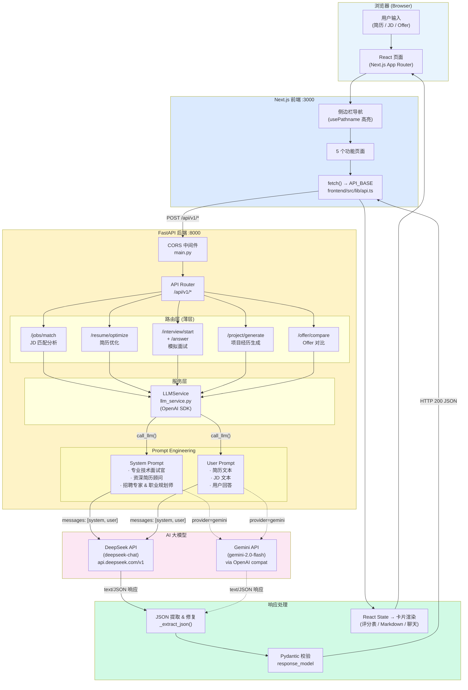

# AI 求职助手 — 系统架构

## 请求全链路流程



## 目录结构

```
ai-job-assistant/
├── frontend/                        # Next.js 15 + Tailwind CSS 4
│   └── src/app/
│       ├── layout.tsx               # Sidebar 导航布局
│       ├── job-analysis/            # JD 匹配分析
│       ├── resume-optimizer/        # 简历优化
│       ├── mock-interview/          # AI 模拟面试 (聊天 UI)
│       ├── project-gen/             # 项目经历生成 (STAR)
│       ├── offer-compare/           # Offer 对比 (评分表)
│       └── lib/api.ts               # 后端 API 调用封装
├── backend/                         # FastAPI
│   └── app/
│       ├── main.py                  # 入口 + CORS + load_dotenv()
│       ├── llm_service.py           # OpenAI SDK 封装 (DeepSeek/Gemini)
│       ├── api/                     # 路由层
│       │   ├── router.py            # 路由汇总
│       │   ├── jobs.py              # /jobs/match
│       │   ├── resume.py            # /resume/optimize
│       │   ├── interview.py         # /interview/start + /answer
│       │   ├── project.py           # /project/generate
│       │   ├── offer.py             # /offer/compare
│       │   └── llm.py               # /llm/test
│       ├── agents/                  # AI Agent 业务逻辑
│       │   ├── base.py              # BaseAgent 泛型基类
│       │   ├── job_analyzer.py      # LangChain structured output
│       │   ├── resume_agent.py      # 简历 Agent
│       │   ├── interview_agent.py   # 面试 Agent
│       │   └── career_advisor.py    # 职业规划 Agent
│       └── core/config.py           # Settings (pydantic-settings)
├── ARCHITECTURE.md                  # 本文件
└── docker-compose.yml               # 一键启动
```

## 关键技术决策

| 决策 | 选择 | 理由 |
|------|------|------|
| LLM SDK | OpenAI SDK (`openai`) | DeepSeek API 完全兼容 OpenAI 格式 |
| 结构化输出 | System Prompt + JSON 正则提取 | 轻量、无需 LangChain 依赖，所有端点统一模式 |
| 会话管理 | 内存 `dict[session_id]` | 面试场景需要上下文，简单够用 |
| 前端数据获取 | 原生 `fetch()` | 无额外依赖，页面级 `"use client"` |
| 样式 | Tailwind CSS 4 + `@tailwindcss/postcss` | 零配置，快速原型 |
| JSON 解析 | 正则去尾逗号 + 外层 `{}` 提取 | 防御 LLM 格式不规范 |

## API 端点总览

| 方法 | 路径 | 功能 |
|------|------|------|
| GET | `/health` | 健康检查 |
| POST | `/api/v1/llm/test` | LLM 连通性测试 |
| POST | `/api/v1/jobs/match` | JD vs 简历匹配度分析 |
| POST | `/api/v1/jobs/analyze` | JD 分析 (LangChain) |
| POST | `/api/v1/resume/optimize` | 简历优化 (优势挖掘 + 项目重写) |
| POST | `/api/v1/interview/start` | 开始模拟面试 |
| POST | `/api/v1/interview/answer` | 提交回答 + 评分 |
| POST | `/api/v1/project/generate` | STAR 项目经历生成 |
| POST | `/api/v1/offer/compare` | Offer 多维度对比 |
